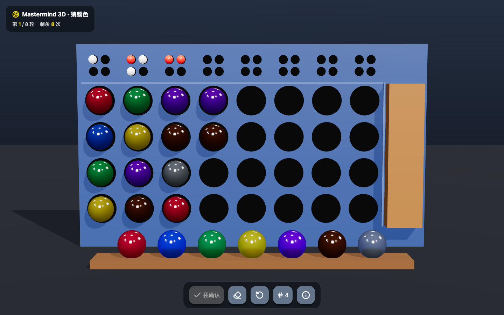
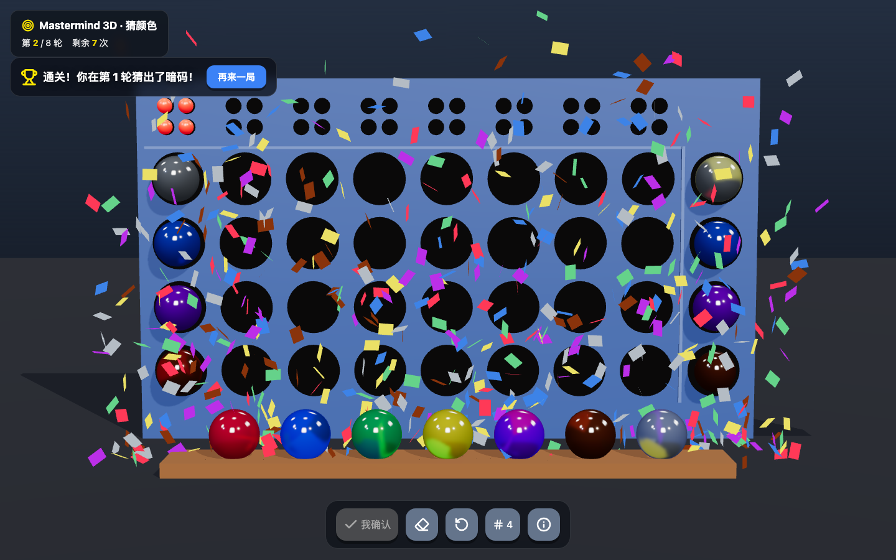
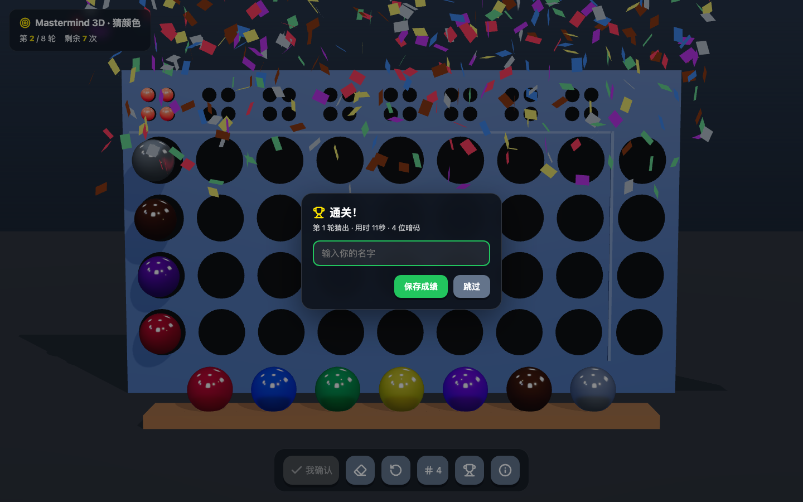
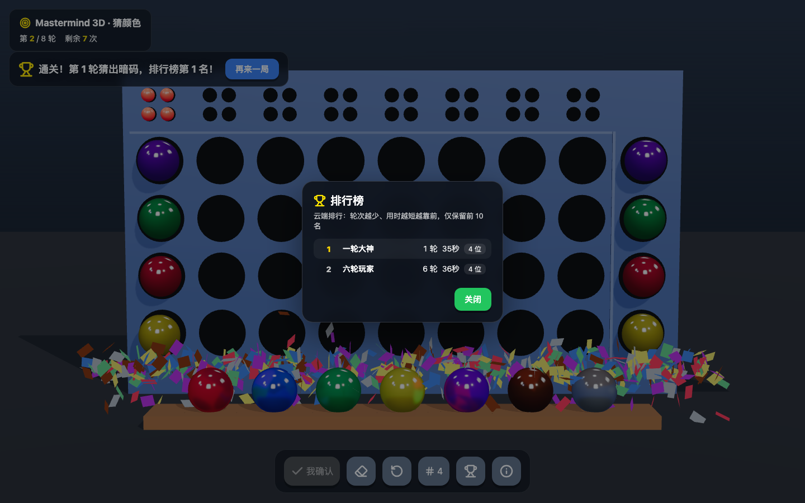
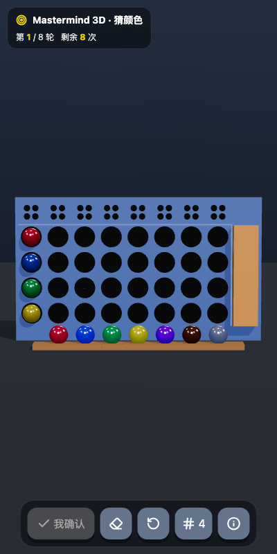

# Mastermind 3D · 猜颜色

**中文** | [English](#english)



用 Three.js 打造的纯前端 3D 猜颜色（Mastermind）推理游戏：玻璃质感弹珠、拖拽交换、手机触屏，8 轮内破解隐藏暗码。

[](LICENSE)
[](https://mastermind.qiaomu.ai)

## 在线试玩

**https://mastermind.qiaomu.ai**

## 这是什么

一个跑在浏览器里的 3D 版 Mastermind 桌游（参考《世界游戏大全51》规则）。系统随机生成一组彩色暗码并藏在木板后面，你用 7 色玻璃球在 8 轮内把它推出来。纯 HTML + ES Module，零构建、零框架依赖，Three.js 依赖已本地化，克隆下来起个静态服务器就能玩。

## 核心能力

| 类别 | 能力 |
| --- | --- |
| 规则 | 7 色玻璃球池（红/蓝/绿/黄/紫/棕/灰），暗码 4 位标准 / 5 位困难可切换，暗码内颜色互异（猜测允许重复），共 8 轮机会 |
| 算法 | 标准 Mastermind 两遍扫描：先统计全对（exact），再用计数表匹配半对（partial），重复颜色不会被过度计数 |
| 3D 表现 | MeshPhysicalMaterial（transmission 0.92）玻璃质感 + RoomEnvironment 环境反射，小球飞入嵌入动画 |
| 结算演出 | 胜利两波彩带 + 闪光灯；无论胜负，右侧木板抽开逐个揭晓暗码 |
| 交互 | 点击填球 / 点击移除 / 鼠标拖拽交换位置 / 回车快捷提交，Lucide 图标按钮 |
| 排行榜 | 通关后弹窗记名留榜，云端排行（同源 `/api`，按轮次 → 用时排序，仅保留前 10 名，新成绩进榜会挤掉第 10 名），点奖杯图标随时查看 |
| 移动端 | 竖屏自适应布局 + 触屏拖拽，手机可直接玩 |
| 音效 | WebAudio 合成点击/确认/胜利音效（首次点击后激活，符合浏览器策略） |
| 工程 | 无构建步骤、无 React/Vue，Three.js r160 已本地化到 `vendor/`，可完全离线运行 |

## 快速开始

```bash
git clone https://github.com/joeseesun/mastermind-3d.git
cd mastermind-3d
python3 -m http.server 8123
# 打开 http://127.0.0.1:8123
```

任意静态文件服务器都可以（`npx serve`、Nginx、Caddy……）。注意：项目使用 ES Module + importmap，**不能用 `file://` 直接双击打开**，必须走 HTTP。

## 玩法规则

1. 系统随机生成 4 位（困难模式 5 位）暗码，由 7 色玻璃球组成，**暗码中每种颜色至多出现一次**（你的猜测允许重复），暗码藏在右侧木板后。
2. 点击底部托盘里的样本球，小球从上往下飞入当前列的空槽；点击已放入的球可移除；拖动已放入的球可交换位置。
3. 放满后点「我确认」（或按回车）提交，列上方出现反馈小圆点（不对应具体位置）：
   - 红点 = 颜色和位置全对（Exact）
   - 白点 = 颜色对但位置错（Partial）
4. 8 轮内全部猜中即通关；否则木板抽开、逐个揭晓暗码。

## 全对 / 半对算法

`game-logic.js` 中的 `evaluateGuess()`，两遍扫描，重复颜色场景下不会多计：

```text
1) 第一遍：位置与颜色都相同 → exact++；
   其余位置把暗码和猜测分别收进两个"待匹配"数组。
2) 用计数表统计待匹配暗码中各颜色的剩余数量。
3) 第二遍：遍历待匹配猜测，若该颜色剩余数量 > 0，
   则 partial++ 并减 1（每个暗码球最多被匹配一次）。

示例：暗码 [红,红,蓝,黄] vs 猜测 [红,蓝,蓝,黄]
  → exact = 3（位置 0/2/3），待匹配暗码 [红]、猜测 [蓝]
  → partial = 0
```

## 项目结构

```text
├── index.html          # 页面骨架、HUD、importmap
├── styles.css          # 界面样式（桌面 + 手机竖屏自适应）
├── game-logic.js       # 纯逻辑：暗码生成、全对/半对算法、游戏状态机
├── leaderboard.js      # 排行榜客户端：排序/格式化纯函数 + /api 拉取与提交
├── scene-setup.js      # Three.js 场景：相机、灯光、玻璃球、棋盘、彩带
├── ui-interaction.js   # Raycaster 点击/拖拽、提交逻辑、弹窗、WebAudio 音效
├── main.js             # 入口：整合模块，驱动 requestAnimationFrame 主循环
├── server/             # 云端排行榜 API（Node 零依赖，JSON 文件存储）
├── vendor/             # Three.js r160 + RoomEnvironment + Lucide（本地化）
├── test/               # Node 单测（游戏逻辑 + 排行榜纯函数 + API 集成）
└── docs/assets/        # README 截图
```

## 验证

```bash
node test/game-logic.test.mjs      # 全对/半对算法 + 暗码互异性
node test/leaderboard.test.mjs     # 排行榜纯函数（排序/格式化）
node test/leaderboard-api.test.mjs # 排行榜 API 集成（起真实服务进程）
```

游戏逻辑测试覆盖 7 组边界用例（含重复颜色）；排行榜测试覆盖排序优先级、前 10 名截断与挤出、非法数据校验、名字清洗、持久化等 30+ 条断言。

## 部署

游戏本体是纯静态站点，扔到任何静态托管即可（Vercel、Netlify、GitHub Pages、Nginx static root）。**没有排行榜 API 也能玩**：接口不可用时榜单会提示"暂时不可用"，不影响游戏。

云端排行榜（可选）：`server/mastermind-lb.js` 是零依赖 Node 服务（JSON 文件存储，前 10 名截断、名字清洗、限流），用 systemd 常驻在本机私有端口，再让 Nginx 把 `/api/` 反代过去即可：

```bash
PORT=3091 DATA_FILE=/path/to/leaderboard.json node server/mastermind-lb.js
# nginx: location /api/ { proxy_pass http://127.0.0.1:3091; }
```

本站示例：Nginx static root + systemd 服务，无 Docker。

## 限制

- 需要支持 WebGL 的浏览器（Chrome / Edge / Safari / Firefox 均可）。
- 音效遵守浏览器自动播放策略，需首次点击页面后才会激活。

## 截图

| 桌面棋盘 | 胜利彩带 | 通关记名 | 排行榜 |
| --- | --- | --- | --- |
|  |  |  |  |

| 手机竖屏 |
| --- |
|  |

## 贡献

小展示型项目，Issue / PR 都欢迎。

## 关于作者

**向阳乔木** — 喜欢把好玩的想法做成小产品。

- 主页：[qiaomu.ai](https://qiaomu.ai)
- 博客：[blog.qiaomu.ai](https://blog.qiaomu.ai)
- 推荐：[tuijian.qiaomu.ai](https://tuijian.qiaomu.ai)
- X：[@vista8](https://x.com/vista8)
- GitHub：[@joeseesun](https://github.com/joeseesun)
- 公众号：向阳乔木推荐看

## License

[MIT](LICENSE) © 2026 向阳乔木

---

<a name="english"></a>

## Mastermind 3D (English)

A pure-frontend 3D Mastermind ("guess the colors") puzzle game built with Three.js — glass marbles, drag-to-swap, mobile-ready. Crack the hidden color code within 8 rounds.

**Live demo: https://mastermind.qiaomu.ai**

### What it is

The classic board game Mastermind (as seen in *Clubhouse Games: 51 Worldwide Classics*) re-imagined as a 3D browser game. A secret code of 4 colored marbles (5 in hard mode, 7 colors, no duplicate colors in the secret; duplicates allowed in your guesses) hides behind a wooden board. Fill each row by clicking the tray marbles, drag placed marbles to swap them, then submit to get exact (red) / partial (white) feedback pegs.

### Key features

- Standard two-pass Mastermind scoring (`evaluateGuess()` in `game-logic.js`) — duplicates never over-counted
- Glass look via `MeshPhysicalMaterial` (transmission) + `RoomEnvironment` reflections
- Win: two confetti bursts + flash; win or lose, the board slides away to reveal the secret
- Click-to-place / click-to-remove / drag-to-swap, Enter to submit, Lucide icon buttons
- Leaderboard: win → name prompt → cloud ranking by rounds then time (top 10 kept, new scores squeeze #10 out), trophy icon opens it anytime. Zero-dependency Node service in `server/` with JSON-file storage; the game still works when the API is down
- Mobile portrait layout with touch drag; WebAudio-synthesized sound effects
- No build step, no framework — Three.js r160 is vendored in `vendor/`, runs fully offline

### How to run

```bash
git clone https://github.com/joeseesun/mastermind-3d.git
cd mastermind-3d
python3 -m http.server 8123
# open http://127.0.0.1:8123
```

Any static file server works. ES modules + importmap require HTTP — opening `index.html` via `file://` will not work.

Optional cloud leaderboard: `PORT=3091 node server/mastermind-lb.js`, then reverse-proxy `/api/` to it (see the Chinese deployment section for details). The game degrades gracefully without it.

### Verified by

```bash
node test/game-logic.test.mjs      # exact/partial scoring + secret uniqueness
node test/leaderboard.test.mjs     # leaderboard pure functions
node test/leaderboard-api.test.mjs # leaderboard API integration (spawns real server)
```

Covers 7 edge cases of the exact/partial scoring algorithm (including duplicate colors) plus secret-code uniqueness, and 30+ leaderboard assertions (ordering, top-10 squeeze-out, validation, name sanitizing, persistence).

### Limits

- Requires a WebGL-capable browser.
- Sound activates only after the first user interaction (browser autoplay policy).

### License

[MIT](LICENSE) © 2026 向阳乔木 ([@joeseesun](https://github.com/joeseesun))
